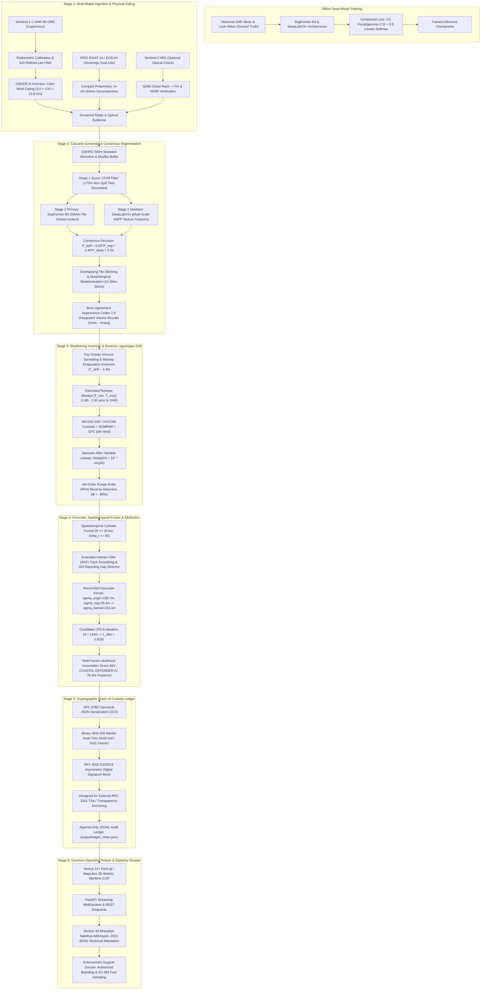

# SAGARDRISHTI: Complete 6-Stage Operational Architecture & Implementation Plan
**Problem Statement Reference: SIH26143**  
**Repository:** `ayushshandilya-dev/Sagardrishti`  
**Target Beneficiaries:** Indian Coast Guard (ICG, Ministry of Defence) & DG Shipping (Ministry of Ports, Shipping and Waterways)

---

## 1. System Mission & Current State

SAGARDRISHTI is an end-to-end autonomous maritime surveillance, backtracking, and forensic attribution platform designed to detect illegal bilge and slop discharges (MARPOL 73/78 Annex I), reconstruct reverse drift trajectories under real oceanographic conditions, isolate suspect vessels using multi-source spatiotemporal kinematics, and seal judicial evidence in a tamper-evident cryptographic ledger compliant with Section 65B of the Indian Evidence Act / Bharatiya Sakshya Adhiniyam, 2023.

### Current Implementation Status
* **Test Suite:** 69/69 automated tests passing in ~3.8 seconds (`pytest tests/ -v`).
* **CLI Pipeline:** `python main.py pipeline` executes all 6 stages end-to-end, writing:
  * `output/evidence_dossier.pdf` (statutory forensic dossier)
  * `output/evidence_dossier.json` (canonical JSON evidence bundle)
  * `output/ledger_chain.json` ($O(1)$ append-only block ledger)
* **Backend API:** FastAPI running on `http://127.0.0.1:8000` with full health checks, scenario dispatching, and REST/WebSocket endpoints.
* **Frontend Web App:** Next.js 14 + Deck.gl + MapLibre 3D Common Operating Picture (COP) running on `http://localhost:3000`.
* **Master Specification:** `architectureSIH26143.pdf` compiled and verified at project root (5 pages, publication-grade styling, zero unrendered glyphs).

---

## 2. Comprehensive 6-Stage Technical Architecture



---

## 3. Subsystem Breakdown & Repository Mapping

### Stage 1: Multi-Modal Ingestion & Radiometric Conditioning
* **Core Modules:** [`core/sar/preprocessing.py`](core/sar/preprocessing.py), [`core/sar/cmod5.py`](core/sar/cmod5.py), [`core/sar/eos04.py`](core/sar/eos04.py), [`core/optical/sentinel2.py`](core/optical/sentinel2.py)
* **Mathematical & Physical Foundations:**
  * **Bragg Backscatter Damping:** Capillary wave damping by surfactant films drops $\sigma^0$ by $6\text{ to }15\text{ dB}$ across C-band VV/VH.
  * **CMOD5.N Wind Inversion:** Strict wind gating enforces $3.0\text{ m/s} \le U_{10} \le 12.0\text{ m/s}$. Flags false-positive calm-water specular reflectors ($<3\text{ m/s}$) and dispersant wave-breaking conditions ($>12\text{ m/s}$).
  * **Compact Polarimetry ($m\text{--}\chi$ Decomposition):** Adapts ISRO RISAT-1A (EOS-04) CTLR hybrid polarimetry Stokes parameters $[S_0, S_1, S_2, S_3]$:
    $$m = \frac{\sqrt{S_1^2 + S_2^2 + S_3^2}}{S_0}, \quad \sin(2\chi) = -\frac{S_3}{m S_0}$$
    Separates biogenic organic look-alikes from petroleum slicks.
  * **Data Governance Architecture:** 
    * Primary default: ESA Copernicus Sentinel-1 IW GRD (100% open, global access).
    * Dual-use sovereign adapter: ISRO Bhoonidhi Level-1/2 open products for research + direct Coast Guard / MoD high-priority feeds for live operations.

---

### Stage 2: Cascade Segmentation & Bonn Volumetric Quantification
* **Core Modules:** [`core/sar/cascade.py`](core/sar/cascade.py), [`core/sar/detection.py`](core/sar/detection.py), [`core/sar/losses.py`](core/sar/losses.py), [`core/sar/classifier.py`](core/sar/classifier.py)
* **Architecture:**
  * **Coastline Masking:** GSHHG shoreline + SRTM 30m with a strict $500\text{ m}$ seaward buffer to suppress mudflats, estuaries, and harbor structures.
  * **Stage 1 Scout:** CFAR filter ($T = \mu_{\text{bg}} - k \sigma_{\text{bg}}$) rejects $>75\%$ of non-spill open ocean tiles, saving GPU compute cycles.
  * **Stage 2 Dual-Engine Deep Segmenters:**
    1. *SegFormer-B3 (Primary Global Segmenter):* Hierarchical Transformer encoder with Mix-FFN decoder; captures long-range spatial context across 10–30 km narrow discharge trails.
    2. *DeepLabV3+ (Multi-Scale ASPP Validator):* Employs atrous spatial pyramid pooling ($r = [6, 12, 18]$) with depthwise separable convolutions to isolate localized bilge dumps from ambient wave clutter.
  * **Compound Loss Function:**
    $$\mathcal{L}_{\text{total}} = 0.5 \cdot \mathcal{L}_{\text{Focal}}(\gamma=2.0, \alpha=0.75) + 0.5 \cdot \mathcal{L}_{\text{Lov\'asz-Softmax}}$$
    Solves extreme class imbalance ($<0.1\%$ spill pixels) while directly maximizing the Jaccard index.
  * **Bonn Agreement Volumetric Quantification:** Classifies pixels across BAOAC Codes 1 to 5 (Sheen $0.1\ \mu\text{m}$ to Heavy Emulsion $100\ \mu\text{m}$) and computes numerical surface integrals:
    $$V_{\text{spill}} = \iint T(x, y)\,dx\,dy, \quad M_{\text{spill}} = \rho_{\text{oil}} V_{\text{spill}}$$

---

### Stage 3: Weathering Inversion & Hydrodynamic Backtracking
* **Core Modules:** [`core/drift/backtrack.py`](core/drift/backtrack.py), [`core/drift/weathering.py`](core/drift/weathering.py), [`core/metocean/currents.py`](core/metocean/currents.py), [`core/metocean/wind.py`](core/metocean/wind.py)
* **Mathematical & Physical Formulations:**
  * **Fay Spreading & Mackay Evaporative Exposure Inversion:**
    $$F_e = \left(\frac{T_K}{1158}\right) \ln\left(1 + \frac{K_a T_e}{V_0}\right)$$
    Inverts measured slick thickness and volatile loss fraction to determine temporal release window $[T_{\text{min}}, T_{\text{max}}]$ (typically 4–8 hours prior to SAR acquisition).
  * **Hydrodynamic Vector Ingestion:** INCOIS Ocean State Forecasts (OSF) / HYCOM $1/12^\circ$ currents ($\vec{u}_{\text{curr}}$) and NCMRWF / GFS 10m surface winds ($\vec{u}_{10}$).
  * **Samuels-Allen Variable Leeway:**
    $$\vec{u}_{\text{drift}} = \vec{u}_{\text{curr}} + \alpha_w \cdot \mathbf{R}[\theta(\phi)] \cdot \vec{u}_{10}$$
    Wind leeway $\alpha_w \in [0.030, 0.035]$, deflection angle $\theta(\phi) = 16^\circ \sin(\phi)$ (varies from $1.7^\circ$ at $6^\circ\text{N}$ to $6.3^\circ$ at $23^\circ\text{N}$ in the Indian EEZ).
  * **4th-Order Runge-Kutta (RK4) Backtracking:** Integrates backwards with time step $dt = -300\text{ s}$ to pinpoint the release origin $\vec{x}_{\text{origin}}(t_0)$.

---

### Stage 4: Kinematic Fusion & Forensic Attribution
* **Core Modules:** [`core/correlation/attribution.py`](core/correlation/attribution.py), [`core/correlation/traffic_filter.py`](core/correlation/traffic_filter.py), [`core/correlation/anomaly.py`](core/correlation/anomaly.py), [`core/correlation/explainability.py`](core/correlation/explainability.py), [`core/ais/interpolator.py`](core/ais/interpolator.py)
* **Formulations & Reconciliation:**
  * **Traffic Funnel Filter:** Filters candidates within spatiotemporal cylinder ($R \le 35\text{ km}, |\Delta t| \le 6\text{ h}$) and weeds out anchored/stationary crafts ($\text{SOG} < 0.5\text{ knots}$).
  * **Dark-Ship Gap Detection:** Identifies intentional AIS silences ($>30\text{ min}$) and performs dead-reckoning with expanding uncertainty bounds.
  * **Sensor Error & Diffusion Kernel Reconciliation:**
    $$\sigma_{\text{origin}} = \sqrt{\sigma_{\text{init}}^2 + 2 K_{\text{diff}} T_{\text{drift}}} = \sqrt{100^2 + 2(2.5)(8640)} \approx 230.7\text{ m}$$
    $$\sigma_{\text{registration}} = \sqrt{\sigma_{\text{SAR}}^2 (20\text{m}) + \sigma_{\text{AIS}}^2 (15\text{m}) + \sigma_{\text{jitter}}^2 (25\text{m})} \approx 35.4\text{ m}$$
    $$\sigma_{\text{kernel}} = \sqrt{\sigma_{\text{origin}}^2 + \sigma_{\text{registration}}^2} = \sqrt{230.7^2 + 35.4^2} \approx 233.4\text{ m}$$
  * **Closest Point of Approach (CPA) & Distance Likelihood:**
    For top suspect (`MV COASTAL DEFENDER-IV`) with realistic GPS CPA $d = 143\text{ m}$:
    $$L_{\text{dist}} = \exp\left(-\frac{143^2}{2 \cdot 233.4^2}\right) \approx 0.829$$
  * **Dirichlet-Categorical Bayesian Posterior:**
    Normalizes multi-factor likelihoods into calibrated probabilities:
    $$\mathbf{P}(\text{MV COASTAL DEFENDER-IV}) = 76.5\%, \quad \mathbf{P}(\text{Tanker Alpha}) = 23.5\% \quad (\Sigma = 100.0\%)$$

---

### Stage 5: Cryptographic Ledger & Evidence Integrity
* **Core Modules:** [`core/evidence/ledger.py`](core/evidence/ledger.py), [`api/db.py`](api/db.py)
* **Security & Admissibility Design:**
  * **Deterministic Serialization:** RFC 8785 JSON Canonicalization Scheme (JCS) guarantees canonical hashing across architectures.
  * **Binary Merkle Tree:** $\text{SHA-256}(0x00 \mathbin{\Vert} M_i)$ for leaves and $\text{SHA-256}(0x01 \mathbin{\Vert} L \mathbin{\Vert} R)$ for interior nodes to eliminate second-preimage vulnerabilities.
  * **Cryptographic Hash Chain:** Replaced PoW mining with sequential block hashing ($H_k = \text{SHA-256}(H_{k-1} \mathbin{\Vert} \text{Root}_k \mathbin{\Vert} T_k \mathbin{\Vert} \text{ID})$) and RFC 8032 Ed25519 digital signatures.
  * **True $O(1)$ Persistence:** Blocks appended sequentially to `output/ledger_chain.json` with full chain integrity validation on reload.
  * **External Anchoring Specification:** Merkle roots structured as publication payloads designed for RFC 3161 Time-Stamp Authorities (TSA) or public transparency logs.

---

### Stage 6: Common Operating Picture & Statutory Judicial Dossier
* **Core Modules:** [`frontend/src/`](frontend/src/), [`api/main.py`](api/main.py), [`core/evidence/ledger.py`](core/evidence/ledger.py)
* **Capabilities:**
  * **WebGL 3D Common Operating Picture:** Next.js 14 + Deck.gl rendering SAR backscatter rasters, segmented slick contours, reverse drift ribbons, and AIS tracks with uncertainty corridors.
  * **Calibrated Legal Evidentiary Standard:** Framed around establishing **probable cause** to empower the Indian Coast Guard to intercept, board, and conduct chemical fingerprinting (GC-MS fuel sampling).
  * **Section 65B IEA / BSA 2023 Technical Attestation Clause:** Formulates system integrity, software kernel hash, and ingestion digests, providing the verifiable prerequisite for the designated human officer to execute the certificate.

---

## 4. Verification & Validation Protocol

### Automated Test Suite
```powershell
python -m pytest tests/ -v
```
* Coverage: 69 test cases across SAR preprocessing, CMOD5.N, EOS-04 adapter, cascade CFAR, SegFormer/DeepLab detection, Fay-Mackay weathering, RK4 drift, AIS interpolation, Bayesian attribution, and tamper-evident ledger integrity.

### End-to-End Pipeline Execution
```powershell
python main.py pipeline
```
* Validates full dataflow from sample SAR scene ingestion through Section 65B dossier generation.

### Master Architecture PDF Compilation
```powershell
python generate_architecture_pdf.py
```
* Compiles `architectureSIH26143.pdf` (5 pages, publication-grade layout with running headers, footers, two-pass numbering, and tables).

---

## 5. Live Service Verification
* **FastAPI Backend:** Active on `http://127.0.0.1:8000` (`curl http://127.0.0.1:8000/api/v1/health` $\to$ `status: healthy`).
* **Next.js Frontend:** Active on `http://localhost:3000` with live MapLibre/Deck.gl visualization.
